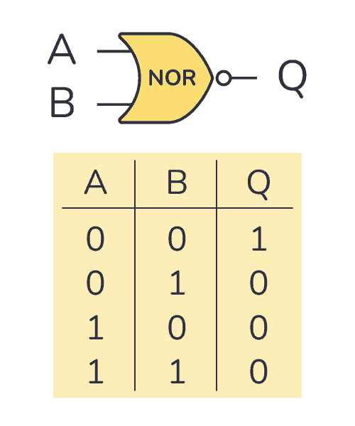
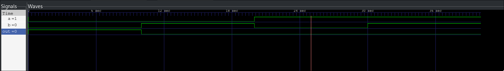

# Nor Gate

## Files
- nor_gate.v: Verilog code for nor gate
- nor_gate_tb.v: Verilog test case code for nor gate

## To Compile

Compilation usage of iverilog:
    iverilog -o [output_path] [verilog_source_files]

To compile nor_gate code:

    iverilog -o nor_gate.vvp nor_gate.v nor_gate_tb.v

- This command will create a file called `nor_gate.vvp`

## Creating a wave file

After compilation:
    
    vvp [vvp_source_file]

For this example:
    
    vvp nor_gate.vvp

- This command will create a file called `nor_gate.vcd`
- Then this file can be fed to a wave simulation software like gtkwave

### Note on creating a wave file

To be able to create a wave file using iverilog (Icarus Verilog)

One need to import these lines in the test code:

    $dumpfile(file_name);
    $dumpvars(0, test_module_name);

This example uses:

    $dumpfile("nor_gate.vcd");
    $dumpvars(0, nor_gate_tb);

